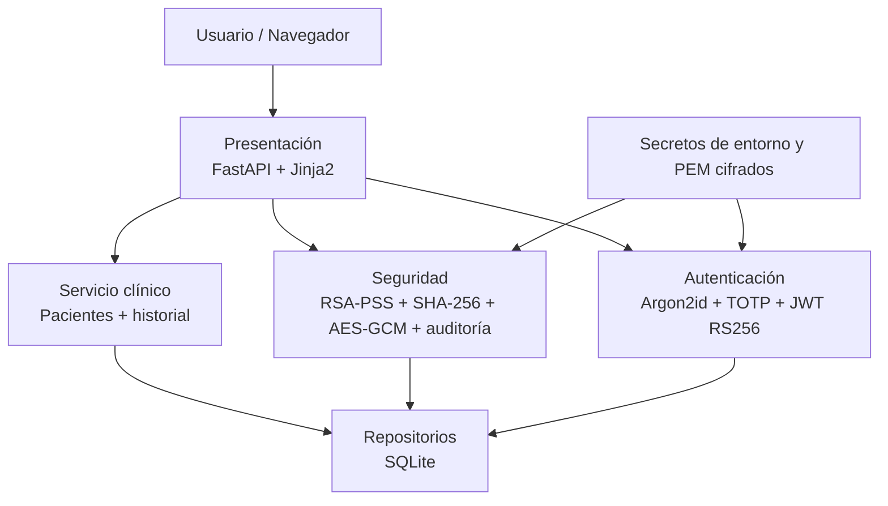

# Sistema Seguro: Hospital v1.1.0

**Demostrador académico de ciberseguridad aplicado a un expediente clínico electrónico.**

Sistema Seguro: Hospital implementa autenticación multifactor, control de acceso por roles, firma digital de notas clínicas y una bitácora encadenada para demostrar **autenticidad, integridad, no repudio y trazabilidad**. Está construido con Python 3.12, FastAPI, Jinja2 y SQLite.

> **Alcance:** prototipo académico. No está certificado para información clínica real ni sustituye controles de infraestructura, cumplimiento, continuidad o privacidad exigibles a un sistema sanitario de producción.

## Controles implementados

| Objetivo | Implementación |
|---|---|
| Autenticación | Argon2id + TOTP RFC 6238 + JWT RS256 |
| Autorización | RBAC y revalidación de cuenta activa en cada petición protegida |
| Integridad de notas | SHA-256 + firma RSA-PSS por médico |
| Auditoría | Cadena SHA-256 con `ip_origen`, `BEGIN IMMEDIATE` y triggers anti-UPDATE/DELETE |
| Secretos | `SECRET_KEY` solo por entorno; TOTP cifrado con AES-256-GCM; llaves privadas PEM cifradas |
| Sesión web | Cookies HttpOnly/SameSite=Strict, `Secure` configurable, CSRF double-submit |
| Endurecimiento HTTP | CSP, HSTS configurable, anti-framing, `nosniff`, no-cache en contenido dinámico |
| Resistencia a abuso | Rate limiting de autenticación y auditoría de accesos denegados |
| Persistencia | SQL parametrizado; archivos de claves fuera del mount estático y fuera de Git |

## Arquitectura



Patrones principales: **Repository, Factory, Decorator y Strategy**. El modelo de amenazas se documenta en [`docs/modelo-amenazas.md`](docs/modelo-amenazas.md).

## Estructura del repositorio

```text
sistema-seguro-hospital-v1.1.0/
├── app/                    # aplicación y controles
├── db/                     # esquema y semilla
├── docs/                   # arquitectura, seguridad y modelo de amenazas
├── evidencias/             # resultados de validación reproducibles
├── llaves/                 # generado localmente; ignorado por Git
├── tests/                  # pruebas de integración y seguridad
├── .github/workflows/      # CI sin secretos estáticos
├── .env.example            # solo placeholders
├── README.md
├── SECURITY.md
├── TESTING.md
└── requirements*.txt
```

## Instalación local segura

Desde PowerShell, en la raíz del proyecto:

```powershell
$PY = "python"

# Valores efímeros de la sesión de terminal; no se guardan en Git.
$env:APP_ENV = "development"
$env:DEMO_MODE = "true"
$env:DEMO_TOTP_VIEWER = "false"
$env:COOKIE_SECURE = "false"   # solo porque la demo usa http://127.0.0.1
$env:HTTPS_ONLY = "false"
$env:SECRET_KEY = & $PY -c "import secrets; print(secrets.token_urlsafe(48))"
$env:DEMO_PASSWORD = & $PY -c "import secrets; print(secrets.token_urlsafe(18))"

& $PY -m pip install -r requirements.txt
& $PY -m db.semilla
& $PY -m uvicorn app.main:app --host 127.0.0.1 --port 8000
```

Abra `http://127.0.0.1:8000`.

La semilla imprime la contraseña temporal y genera QR TOTP en `llaves/`. Mantenga **el mismo `SECRET_KEY` y `DEMO_PASSWORD`** durante la ejecución; el primero protege TOTP y la llave privada de firma JWT, y el segundo permite que el botón de restauración regenere la demo sin cambiar las credenciales.

### Visor TOTP opcional

Si no se dispone de un autenticador durante la exposición:

```powershell
$env:DEMO_TOTP_VIEWER = "true"
```

Después reinicie Uvicorn. `/demo/codigos` solo responde desde loopback. No debe habilitarse al compartir el servicio en red.

## Variables de entorno

| Variable | Default | Propósito |
|---|---:|---|
| `APP_ENV` | `production` | Etiqueta de entorno |
| `DEMO_MODE` | `false` | Monta rutas de demostración |
| `DEMO_TOTP_VIEWER` | `false` | Habilita visor TOTP solo en loopback |
| `COOKIE_SECURE` | `true` | Marca cookies como Secure |
| `HTTPS_ONLY` | igual a `COOKIE_SECURE` | Agrega HSTS |
| `SECRET_KEY` | sin default | Secreto maestro obligatorio, mínimo 32 caracteres |
| `DEMO_PASSWORD` | aleatorio si falta | Contraseña de usuarios de semilla; para restauración debe fijarse en el entorno |

No se versionan `.env`, bases SQLite, llaves, QR ni credenciales.

## Roles

| Acción | Admin | Doctor | Enfermero | Administrativo |
|---|:---:|:---:|:---:|:---:|
| Consultar expedientes | — | ✓ | ✓ | ✓ |
| Crear/firmar notas | — | ✓ | — | — |
| Ver auditoría | ✓ | ✓ | — | ✓ |
| Gestionar usuarios | ✓ | — | — | — |
| Panel de ataque demo | ✓ | ✓ | — | — |

Los accesos denegados se registran en la bitácora. Si una cuenta se desactiva, su JWT deja de ser aceptado de inmediato; sus firmas históricas continúan verificándose con la llave pública almacenada.

## Pruebas

```powershell
& $PY -m pip install -r requirements-dev.txt
& $PY -m pytest -q
```

La suite v1.1.0 cubre semilla e integridad, MFA, matriz RBAC, CSRF, rate limiting, concurrencia de auditoría, manipulación de hashes/IP, restauración, cifrado de secretos, invalidación inmediata de sesión, cabeceras HTTP y persistencia de la verificabilidad de firmas históricas.

Consulte [`TESTING.md`](TESTING.md) y [`evidencias/README.md`](evidencias/README.md).

## Documentación técnica

- [`docs/informe-tecnico-extendido.md`](docs/informe-tecnico-extendido.md) — documentación técnica complementaria del proyecto.
- [`docs/modelo-amenazas.md`](docs/modelo-amenazas.md) — STRIDE, MITRE ATT&CK, X.800 y Defense in Depth.
- [`docs/arquitectura.md`](docs/arquitectura.md) — capas, patrones y fronteras de confianza.
- [`docs/seguridad.md`](docs/seguridad.md) — catálogo de controles.
- [`docs/revision-seguridad.md`](docs/revision-seguridad.md) — correcciones v1.1.0.
- [`docs/demo.md`](docs/demo.md) — guion de demostración.
- [`docs/anexos-codigo.md`](docs/anexos-codigo.md) — índice de anexos/código y evidencias.
- [`docs/matriz-cumplimiento.md`](docs/matriz-cumplimiento.md) — trazabilidad requisito → artefacto.
- [`SECURITY.md`](SECURITY.md) — reglas de manejo seguro del repositorio.

## Limitaciones explícitas

El prototipo **no equivale a una plataforma clínica productiva**. SQLite no proporciona alta disponibilidad ni control de acceso por motor; la base clínica no está cifrada a nivel de aplicación; el rate limiter vive en memoria; los logs son inmutables lógicamente, no WORM; las llaves siguen residiendo en el host; y HTTPS depende de la capa de despliegue. En producción se requieren, entre otros, KMS/HSM, cifrado de volumen o de base, TLS gestionado, SIEM/remotización de logs, respaldos, segregación de redes, gestión centralizada de identidades y evaluación normativa específica.
