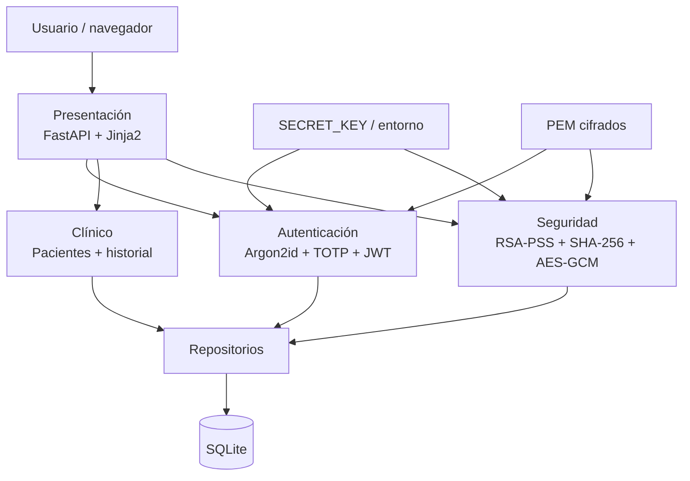
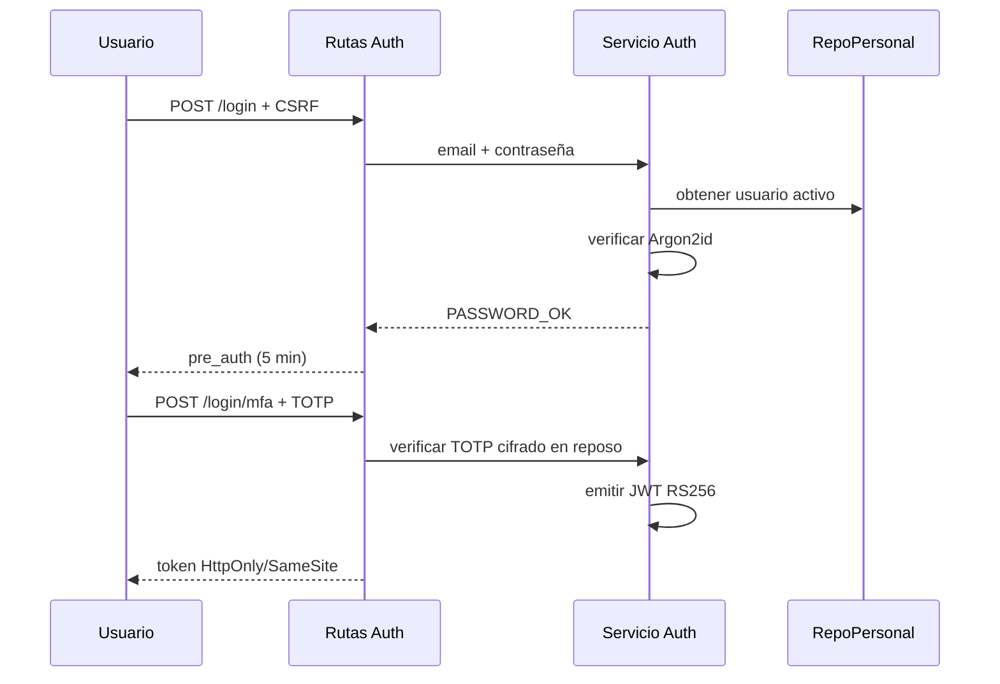
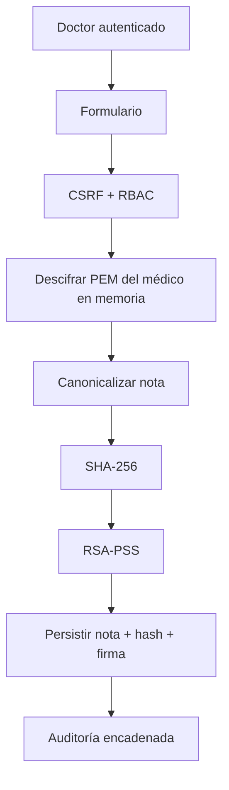

# Arquitectura de Clínica Segura v1.1.0

## Propósito

La arquitectura separa presentación, autenticación, lógica clínica, seguridad y persistencia para mejorar revisabilidad y pruebas. Es una separación modular dentro de un único proceso FastAPI; no debe confundirse con aislamiento físico entre servicios.

## Vista general



## Módulos

| Área | Directorio | Responsabilidad |
|---|---|---|
| Presentación | `app/presentacion/` | Rutas, formularios, CSRF, cookies, RBAC y plantillas |
| Autenticación | `app/autenticacion/` | Argon2id, TOTP, JWT y reglas de contraseña |
| Clínica | `app/clinico/` | Dominio clínico |
| Seguridad | `app/seguridad/` | Firma, cifrado de secretos, hash chain, verificación, rate limiter y headers |
| Datos | `app/datos/` | Repositorios y SQL parametrizado |
| Ensamblado | `app/fabrica.py` | Composición de dependencias |
| Persistencia | `db/` | Esquema, triggers y semilla |

## Patrones

- **Repository:** encapsula el acceso SQL.
- **Factory:** centraliza ensamblado de servicios/repositorios.
- **Decorator:** `AuditoriaDecorator` añade trazabilidad a operaciones clínicas.
- **Strategy:** el módulo de firma permite desacoplar el algoritmo; RSA-PSS es la estrategia activa.

## Autenticación



El JWT exige `sub`, `iss`, `aud`, `iat`, `nbf`, `exp` y `jti`. En cada petición protegida se valida el token y se vuelve a consultar que el usuario esté activo y conserve el rol esperado.

## Creación de nota



## Auditoría

```text
campos = hash_anterior, id, personal_id, entidad_afectada, entidad_id,
         accion, detalle, ip_origen, fecha_hora
hash_actual = SHA-256( join(SEP=0x1F, campos) )
```

`BEGIN IMMEDIATE` serializa la lectura del hash previo y la inserción. Triggers de SQLite bloquean `UPDATE` y `DELETE` ordinarios sobre `audit_log`. El verificador recalcula toda la cadena.

## Secretos y material criptográfico

- `SECRET_KEY` sólo por variable de entorno, mínimo 32 caracteres.
- TOTP cifrado mediante AES-256-GCM; la clave se deriva con HKDF-SHA256.
- Llave privada JWT persistida como PEM cifrado.
- Llaves privadas de médicos cifradas con su contraseña para el escenario de demo.
- Archivos sensibles fuera de `app/estaticos/` y excluidos del repositorio.

## Fronteras de confianza

1. Navegador → FastAPI: entrada no confiable.
2. Aplicación → SQLite: persistencia y transacciones.
3. Aplicación → sistema de archivos: llaves y QR sensibles.
4. Variables de entorno → aplicación: secretos de runtime.
5. Host → red: en producción requiere TLS/reverse proxy; HTTP sólo para loopback controlado.

## Deuda técnica productiva

SQLite, rate limiting en memoria, llaves en host, ausencia de SIEM/log remoto, falta de cifrado integral de la BD y dependencia del despliegue para TLS son decisiones válidas para el prototipo, pero no para un sistema clínico productivo.
